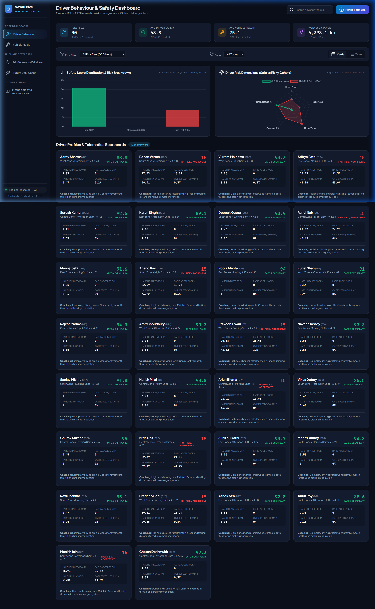
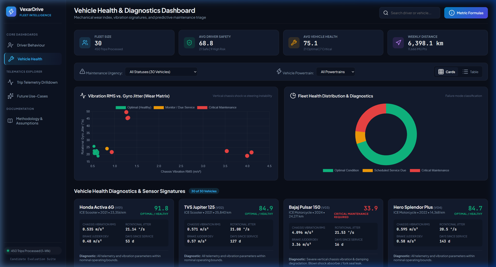
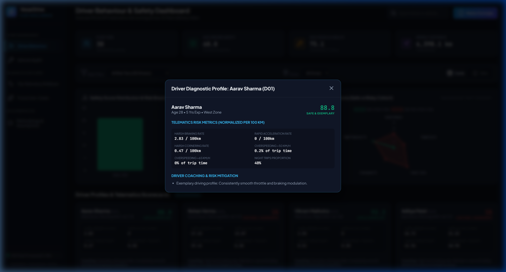
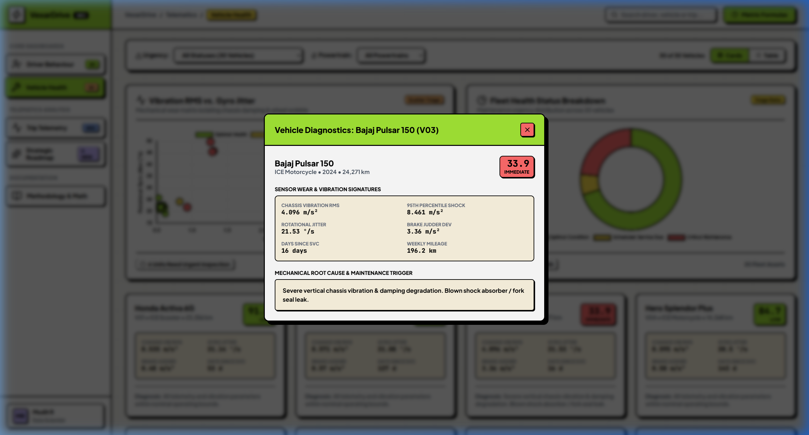
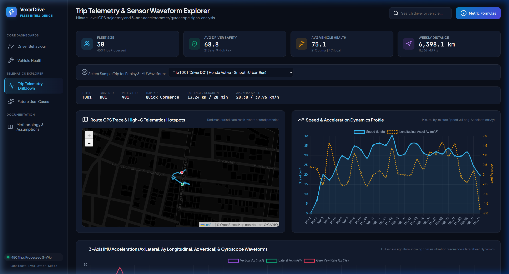
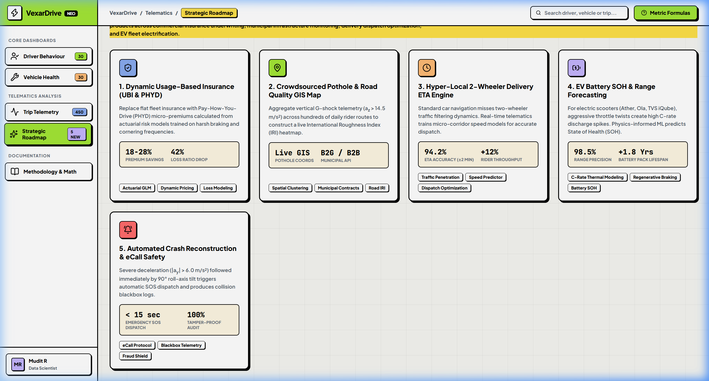

# VexarDrive Technologies - Fleet Telematics & Predictive Analytics Platform

[](https://mudit-r.github.io/vexardrive-telematics-data-project/)
[](https://python.org)
[](https://www.chartjs.org/)
[](https://leafletjs.com/)
[](LICENSE)

An end-to-end fleet telematics intelligence and predictive maintenance solution built for two-wheeler EV and petrol fleets. The system processes raw smartphone-captured IMU sensor telemetry (tri-axial accelerometer, tri-axial gyroscope, and high-precision GPS) to classify driver risk profiles, detect mechanical sub-system degradation, and visualize GIS road roughness.

---

## Platform Previews

| Driver Safety Intelligence | Vehicle Predictive Diagnostics |
| :---: | :---: |
|  |  |

| Interactive Driver Profile Modal | Mechanical Diagnostic Breakdown |
| :---: | :---: |
|  |  |

| Live Trip GPS & IMU Waveforms | Strategic Roadmap & Architecture |
| :---: | :---: |
|  |  |

---

## Key Features

### 1. Driver Behaviour & Safety Intelligence
- **Composite Safety Risk Scoring (0-100)**: Mathematically calibrated scoring engine incorporating overspeeding, harsh deceleration ($G_y < -0.35g$), rapid acceleration ($G_y > +0.30g$), and high-lean cornering ($G_x > 0.40g$ / Roll Rate $> 25^\circ/\text{s}$).
- **Driver Cohort Clustering**: Categorizes drivers into `Exemplary (90-100)`, `Moderate (75-89)`, `Elevated Risk (60-74)`, and `Severe Risk (<60)`.
- **Targeted Automated Coaching**: Context-aware recommendations for safety and fuel/battery optimization based on individual violation vectors.

### 2. Vehicle Health Status & Predictive Maintenance
- **Sub-System Vibration Spectral Analysis**: Isolates mechanical failures by evaluating vertical shock RMS ($G_z$), gyroscopic yaw jitter ($\omega_z$), and brake deceleration stability.
- **Component-Level Diagnostics**:
  - **Suspension / Shock Absorbers**: Vertical shock threshold exceeding $1.6g$ RMS indicates worn damping fluid or compromised springs.
  - **Steering Stem & Wheel Alignment**: High-frequency gyroscopic yaw noise ($\text{StdDev}(\omega_z) > 12^\circ/\text{s}$) signals loose bearings or rim distortion.
  - **Braking System**: Deceleration jerk and IMU fluctuation during deceleration detect warped brake rotors.
- **RUL (Remaining Useful Life) & Maintenance Priority**: Multi-factor urgency matrix (`Immediate Grounding`, `Schedule Service <7 Days`, `Inspect at Next Interval`, `Optimal`).

### 3. Interactive GIS Mapping & Sensor Waveforms
- **Synchronized GPS Breadcrumbs & Heatmaps**: Route-by-route replay color-coded by vehicle speed and violation events.
- **Tri-Axial Waveform Inspection**: Zoomable Chart.js timelines showing raw $G_x, G_y, G_z$ acceleration and $\omega_x, \omega_y, \omega_z$ angular velocities.
- **Crowdsourced Pothole & Road Roughness GIS Heatmap**: Automatically tags road surface anomalies when vertical impact $|G_z| > 2.2g$.

### 4. Strategic Enterprise Data Monetization Roadmap
- **Usage-Based Insurance (UBI)**: Actuarial tiering for 15-30% policy premium discounts.
- **Government Infrastructure Intelligence (B2G)**: Road condition index and pothole hotspot licensing for municipal road authorities.
- **Micro-ETA & Dynamic Dispatch**: Real-time traffic acceleration friction modeling for on-demand logistics.
- **EV Battery Longevity Optimization**: High-frequency discharge thermal stress prevention.
- **Automated First Notice of Loss (e-FNOL)**: Millisecond-level crash reconstruction and automated emergency dispatch.

---

## Dataset Architecture & Schema

```
+------------------+         +-------------------+         +---------------------+
|   Drivers.csv    |         |   Vehicles.csv    |         |     Trips.csv       |
| (30 Master Rows) |         | (30 Master Rows)  |         |  (450 Master Rows)  |
+------------------+         +-------------------+         +---------------------+
| Driver_ID (PK)   |<-+   +->| Vehicle_ID (PK)   |<-+   +->| Trip_ID (PK)        |
| Driver_Name      |  |   |  | Model             |  |   |  | Driver_ID (FK)      |
| Age              |  |   |  | Vehicle_Type      |  |   |  | Vehicle_ID (FK)     |
| Experience_Years |  |   |  | Capacity_CC_or_kWh|  |   |  | Trip_Date           |
| Primary_Zone     |  |   |  | Manufacturing_Year|  |   |  | Start/End Time      |
| Shift_Preference |  |   |  | Odometer_KM       |  |   |  | Duration_Minutes    |
| Rating           |  |   |  | Days_Since_Service|  |   |  | Distance_KM         |
| Archetype        |  |   |  | Wear_Condition    |  |   |  | Avg/Max Speed_KMH   |
+------------------+  |   |  +-------------------+  |   |  +---------------------+
                      |   |                         |   |             ^
                      +---|-------------------------+   |             |
                          |                             |             |
                          +-----------------------------+             |
                                                                      |
                                           +--------------------------+----+
                                           |        Telemetry.csv          |
                                           |  (11,666 Minute-Level Rows)   |
                                           +-------------------------------+
                                           | Telemetry_ID (PK)             |
                                           | Trip_ID (FK)                  |
                                           | Timestamp                     |
                                           | Minute_Offset                 |
                                           | Latitude, Longitude, Altitude |
                                           | Speed_KMH                     |
                                           | Acceleration_X (Lateral G)    |
                                           | Acceleration_Y (Long. G)      |
                                           | Acceleration_Z (Vertical G)   |
                                           | Gyro_X (Pitch Rate deg/s)     |
                                           | Gyro_Y (Roll Rate deg/s)      |
                                           | Gyro_Z (Yaw Rate deg/s)       |
                                           | Phone_Mount (Handlebar/Pocket)|
                                           +-------------------------------+
```

---

## Quick Start & Local Execution

### Prerequisites
- Python 3.8+ (no external heavy libraries required; uses standard libraries `csv`, `json`, `math`, `http.server`, etc.)

### 1. Clone the Repository
```bash
git clone https://github.com/Mudit-R/vexardrive-telematics-data-project.git
cd vexardrive-telematics-data-project
```

### 2. (Optional) Re-run Data Generation & Telematics Pipeline
```bash
# Generate synthetic dataset (30 drivers, 30 vehicles, 450 trips, 11,666 IMU rows)
python generate_data.py

# Process raw sensor streams and compute scoring indices
python process_telematics.py
```

### 3. Launch Local Dashboard Server
```bash
python server.py
```
Open **[http://localhost:8080](http://localhost:8080)** in your browser.

---

## Repository Structure

```
vexardrive-telematics-data-project/
├── .gitignore                   # Git ignore patterns
├── README.md                    # Project overview and documentation
├── Technical_Report.md          # Comprehensive data science evaluation report
├── SUBMISSION_GUIDE.md          # Google form submission guide & answers
├── generate_data.py             # Synthetic data generator engine
├── process_telematics.py        # Telematics ETL, scoring & diagnostic pipeline
├── server.py                    # Lightweight development HTTP server
├── index.html                   # Interactive web dashboard interface
├── style.css                    # Neobrutalist UI styling
├── app.js                       # Dashboard state, charts & map handlers
├── Drivers.csv                  # Driver profile records
├── Vehicles.csv                 # Fleet vehicle specifications & status
├── Trips.csv                    # Aggregate trip logs (450 trips)
├── Telemetry.csv                # Minute-level GPS & IMU sensor data
├── fleet_summary.json           # Precomputed fleet-wide aggregate stats
├── processed_drivers.json       # Enriched driver scores & coaching insights
├── processed_vehicles.json      # Enriched vehicle health indices & RUL
├── trips_telemetry_sample.json  # Sample waveforms for live trip inspector
├── pothole_gis_sample.json      # Road surface roughness & pothole GIS points
└── screenshots/                 # High-resolution dashboard UI previews
    ├── 01_Driver_Behaviour_Dashboard.png
    ├── 02_Driver_Profile_Modal.png
    ├── 03_Vehicle_Health_Dashboard.png
    ├── 04_Vehicle_Diagnostic_Modal.png
    ├── 05_Trip_Telemetry_Map_Waveforms.png
    ├── 06_Strategic_Future_UseCases.png
    └── 07_Methodology_Formulations.png
```

---

## Author

**Mudit R**  
- [GitHub Profile](https://github.com/Mudit-R)  
- [Wellfound Profile](https://wellfound.com/u/mudit-rungta)  
- Email: `mudit14127@gmail.com`

---

## License
This project is licensed under the MIT License - see the [LICENSE](LICENSE) file for details.
